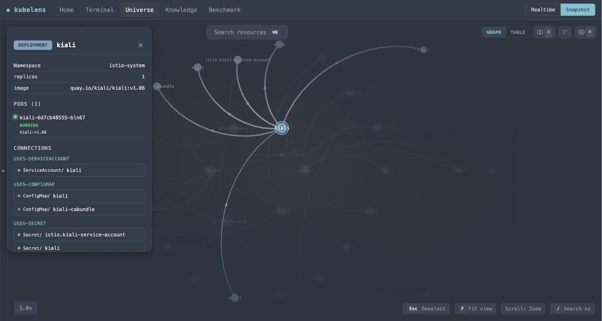

# kubelens

Browser-based Kubernetes visualization. GPU-accelerated resource graph + multi-window kubectl terminal. Runs against a live cluster or offline from exported snapshots.




## Prerequisites

- Node.js 18+
- pnpm (the repo ships a `pnpm-lock.yaml`; install with `npm i -g pnpm` or via Corepack)
- `kubectl` configured with a valid kubeconfig (required for Realtime mode)
- Snapshot mode works offline — no cluster needed

Optional (only for image tag lookups in the rollout panel):
- `aws` CLI for ECR, `gcloud` for Artifact Registry / GCR, `az` for ACR — the registry is detected from the image URL
- `ECR_PROFILE_MAP` in `.env` — maps AWS account IDs to SSO profile names (ECR only). Copy `.env.example` to get started.

## Quick Start

You need `kubectl` already pointed at a cluster (see Prerequisites).

```bash
pnpm install
pnpm run dev
```

Frontend at `http://localhost:4200`, backend at port 3042. The landing page is where you pick a mode and, for offline use, export a snapshot.

## Modes

- **Realtime** — runs kubectl against your live cluster (the default).
- **Snapshot** — reads exported YAML from `k8s-snapshot/`. Create one from the landing page **Export** panel, then switch to Snapshot mode; no cluster needed after that. (`scripts/snapshot-bash.sh` does the same from the CLI if you prefer.)

## Configuration

Which Kubernetes kinds show up in the resource tree and topology graph is driven by `kubelens.config.yaml` (read at startup via `/api/config`), not hardcoded. The committed config works out of the box; to fit it to your own cluster:

```bash
pnpm run init              # detect cluster + registry + CRDs → kubelens.config.yaml
pnpm run init -- --merge   # later: refresh CRDs, keep your edits
```

`init` reads `kubelens.default.yaml` (universal built-ins), infers cluster type and image registry from kubeconfig/images, lists your CRDs via `kubectl api-resources`, and writes a complete config. Discovered CRDs ship off — enable them in the in-app visibility panel.

Or add a kind by hand:

```yaml
resources:
  - { kind: VirtualService, key: virtualservices, resourceType: virtualservices.networking.istio.io,
      namePrefix: virtualservice.networking.istio.io, group: networking.istio.io,
      label: VirtualServices, color: '#7a9eaa', show: [tree], default: [] }
```

- `show` — capability: which views this kind *can* appear in (`tree`, `graph`).
- `default` — default-on views (subset of `show`); omit to default to `show`. `default: []` ships a kind capable-but-off; it appears in the visibility panel for the user to switch on.

## Dev

```bash
pnpm run dev      # frontend + backend
pnpm run build    # production build
pnpm test         # unit tests
```

## Stack

- Angular 20+, signals, standalone components
- `@cosmograph/cosmos` — WebGL force-directed graph
- Express.js, `execFile` (no shell injection)
