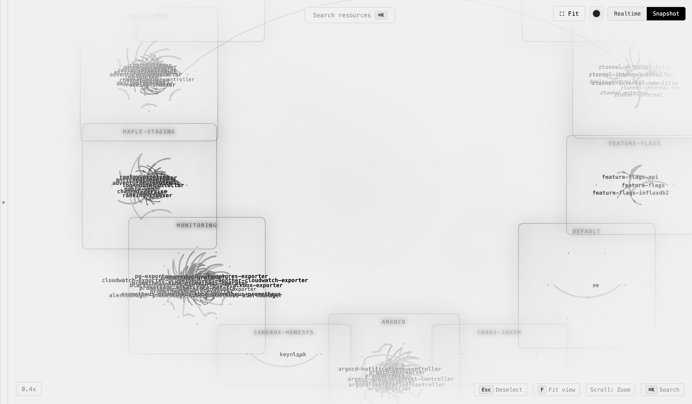
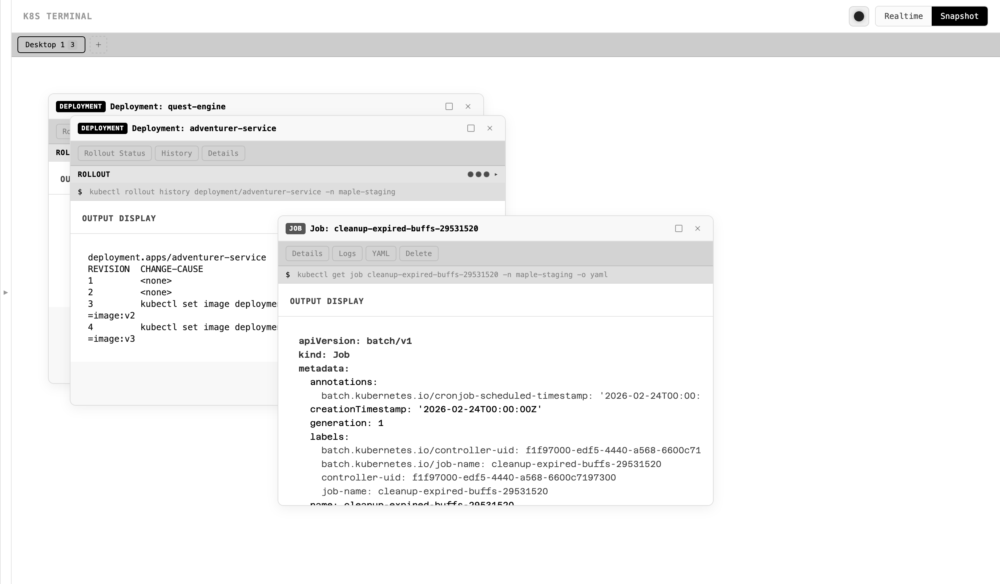

# kubelens

Browser-based Kubernetes visualization. GPU-accelerated resource graph + multi-window kubectl terminal. Runs against a live cluster or offline from exported snapshots.





## Prerequisites

- Node.js 18+
- `kubectl` configured with a valid kubeconfig (required for Realtime mode)
- Snapshot mode works offline — no cluster needed

Optional (only for image tag lookups in the rollout panel):
- `aws` CLI for ECR, `gcloud` for Artifact Registry / GCR, `az` for ACR — the registry is detected from the image URL
- `ECR_PROFILE_MAP` in `.env` — maps AWS account IDs to SSO profile names (ECR only). Copy `.env.example` to get started.

## Quick Start

```bash
npm install
npm run dev
```

Frontend at `http://localhost:4200`. Backend (Node) at port 3042.

## Modes

- **Realtime** — runs kubectl against a live cluster
- **Snapshot** — reads from `k8s-snapshot/` (export via home page or `bash scripts/k8s-export.sh`)

## Configuration

Which Kubernetes kinds show up in the resource tree and topology graph is driven by `kubelens.config.yaml` (read at startup via `/api/config`), not hardcoded. Add your own CRDs there:

```yaml
resources:
  - { kind: VirtualService, key: virtualservices, resourceType: virtualservices.networking.istio.io,
      namePrefix: virtualservice.networking.istio.io, group: networking.istio.io,
      label: VirtualServices, color: '#7a9eaa', show: [tree, graph] }
```

`show` controls which views list the kind (`tree`, `graph`, or both).

## Dev

```bash
npm run dev       # frontend + backend
ng build          # production build
ng test           # unit tests
```

## Stack

- Angular 20+, signals, standalone components
- `@cosmograph/cosmos` — WebGL force-directed graph
- Express.js, `execFile` (no shell injection)
