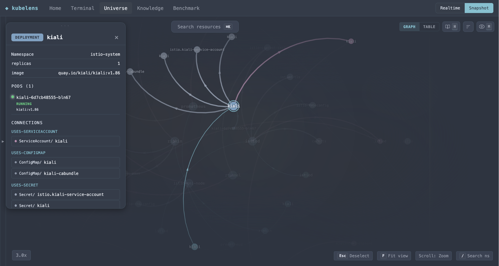

# kubelens

Browser-based Kubernetes visualization. GPU-accelerated resource graph + multi-window kubectl terminal. Runs against a live cluster or offline from exported snapshots.

- **Universe** — the whole cluster as an interactive WebGL graph: workloads, network path, config references
- **Terminal** — floating panels per resource, one-click contextual commands, streaming for long-running ones
- **Registry-aware rollouts** — the deployment panel lists image tags straight from **ECR / Artifact Registry (GCR) / ACR** (detected from the image URL) and swaps versions in one click
- **Snapshot mode** — export once, browse the whole cluster offline; no agents, nothing installed in the cluster




## Quick Start

```bash
npx kubelens
```

Open `http://localhost:3042`. On first run kubelens writes a `kubelens.config.yaml`
next to you with the built-in resource kinds; `npx kubelens init` replaces it with
one built from your own cluster, CRDs and image registry included.

Everything it stores — that config, and any snapshot you export — lands in the
directory you ran it from, so a version bump never loses your setup.

No cluster to point at? [`examples/`](./examples/README.md) spins up a throwaway
[kind](https://kind.sigs.k8s.io/) cluster with a small 3-service demo app, so you
have something real to explore in a couple of commands.

### From a clone

Working on kubelens itself, or want the dev server:

```bash
pnpm install
pnpm run dev
```

Frontend at `http://localhost:4200` with hot reload, backend at 3042, and the
Angular dev server proxies `/api` across. The published package has no proxy:
one port serves the built frontend and the API together.

## Prerequisites

- Node.js 18+
- `kubectl` configured with a valid kubeconfig (required for Realtime mode)
- Snapshot mode works offline — no cluster needed
- pnpm, for the clone path only (the repo ships a `pnpm-lock.yaml`; install with `npm i -g pnpm` or via Corepack)

Optional (only for image tag lookups in the rollout panel):
- `aws` CLI for ECR, `gcloud` for Artifact Registry / GCR, `az` for ACR — the registry is detected from the image URL
- `ECR_PROFILE_MAP` in `.env` — maps AWS account IDs to SSO profile names (ECR only). Copy `.env.example` to get started.

## Modes

- **Realtime** — runs kubectl against your live cluster (the default).
- **Snapshot** — reads exported YAML from `k8s-snapshot/`. Create one from the landing page **Export** panel, then switch to Snapshot mode; no cluster needed after that. (`scripts/snapshot-bash.sh` does the same from the CLI if you prefer.)

An interrupted export leaves a partial `k8s-snapshot/`, and the landing page offers three ways on: **Resume** finishes the namespaces it never reached, **Start over** deletes what is there and exports again, or leave it and use kubelens as it is. A snapshot records which cluster it came from, so if you point kubectl elsewhere between the two runs the panel shows both names and says not to resume — that would put half of each cluster in one directory.

## Configuration

Everything the app shows comes from `kubelens.config.yaml`, not from hardcoded lists. A clone has that file committed; `npx kubelens` writes one on first run. It works untouched, and editing it is how you change what appears.

Two files, clear roles:

- **`kubelens.config.yaml`** — the only file the app reads (at startup, via `/api/config`). Edit it directly to customize your setup.
- **`kubelens.default.yaml`** — a neutral seed (built-in kinds, no CRDs) that `init` builds from. The server never reads it; the `kubelens` CLI copies it to `kubelens.config.yaml` when the working directory has none, so a first run has something to show.

Fit it to your own cluster:

```bash
pnpm run init              # detect cluster + registry + CRDs → kubelens.config.yaml
pnpm run init -- --merge   # later: refresh CRDs, keep your edits
```

`init` reads the seed, infers cluster type and image registry from kubeconfig/images, lists your CRDs via `kubectl api-resources`, and writes a complete config. Discovered CRDs ship off — enable them in the in-app visibility panel. (Edit the seed and re-run `init` to change the shipped defaults; edit `config.yaml` for a one-off.)

Three sections are customizable, all hand-editable:

**Kinds** (`resources`) — which kinds appear in the tree and graph:

```yaml
resources:
  - { kind: VirtualService, key: virtualservices, resourceType: virtualservices.networking.istio.io,
      namePrefix: virtualservice.networking.istio.io, group: networking.istio.io,
      label: VirtualServices, color: '#7a9eaa', show: [tree], default: [] }
```

- `show` — capability: which views this kind *can* appear in (`tree`, `graph`).
- `default` — default-on views (subset of `show`); omit to default to `show`. `default: []` ships a kind capable-but-off; it appears in the visibility panel to switch on.

The example above *is* a hand-added CRD: copy the shape, set `resourceType` to the **group-qualified** plural (`virtualservices.networking.istio.io`, not just `virtualservices`) — that's how kubelens tells CRDs from built-ins. `pnpm run init` autodetects all of this for every CRD in your cluster.

**Panel commands** (`templates`) — the buttons on each resource window, keyed by Kind. `{name}` / `{namespace}` resolve at run time:

```yaml
templates:
  Pod:
    - { name: Logs, command: "kubectl logs {name} -n {namespace} --tail=50 -f" }
    - { name: Delete, command: "kubectl delete pod {name} -n {namespace}" }
```

Flags: `requiresInput` (populate an editable command instead of running it), `disabled` (greyed out).

**Snapshot tables** (`tables`) — column layout for `kubectl get` output in Snapshot mode, keyed by Kind. `value` is a template: `{.path}` reads a field, `{.path|age}` runs a transform, `{...?fallback}` defaults when empty:

```yaml
tables:
  Deployment:
    columns:
      - { name: NAME,  value: "{.metadata.name}", width: 38 }
      - { name: READY, value: "{.status.readyReplicas?0}/{.spec.replicas?1}", width: 8 }
      - { name: AGE,   value: "{.metadata.creationTimestamp|age}" }
```

See the `tables:` comment in `kubelens.default.yaml` for the full transform list.

## Dev

```bash
pnpm run dev         # frontend + backend
pnpm run dev:go      # frontend + the Go backend instead
pnpm run build       # production build
pnpm test            # unit tests (Karma)
pnpm run test:utils  # backend unit tests (node:test)
pnpm run test:go     # Go backend tests (net/http/httptest)
pnpm run test:e2e    # browser tests (Playwright)
```

`test:e2e` starts the dev server itself and drives a real browser, so the first
run needs Playwright's bundled Chromium:

```bash
npx playwright install chromium   # ~130MB, once per Playwright version
```

Already have Google Chrome and would rather not download another browser? Add
`channel: 'chrome'` to the project's `use` block in `playwright.config.ts` and
Playwright launches yours instead. Chrome auto-updates, so the browser under
test drifts with it; the bundled build is pinned and reproducible.

## Stack

- Angular 20+, signals, standalone components
- `@cosmograph/cosmos` — WebGL force-directed graph
- Express.js, `execFile` (no shell injection)
